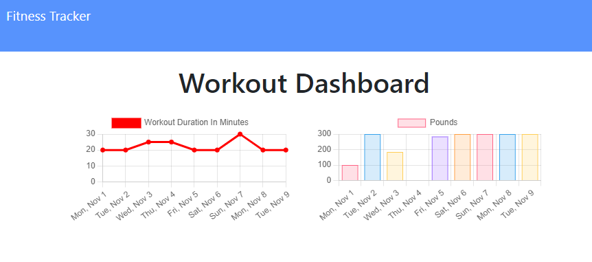

# Fitness_Tracker

## Description
An application that is able to show statistical data of workouts, given input from the user. The user is able to create new workout sessions, as well as
continue their previous session. Main technologies used are MongoDB Atlas, Express

## Table of Contents
* [Usage](#usage)
* [License](#license)
* [Contributing](#contributing)
* [Link](#link)
* [Questions](#questions)

## Usage

The user is able to:  
Add exercises to the most recent workout plan.  
Add new exercises to a new workout plan.

 View the combined weight of multiple exercises from the past seven workouts on the `stats` page.

 View the total duration of each workout from the past seven workouts on the `stats` page.

## License
  
This project is licensed under the MIT license.

## Link
App: https://jeffiftyone-fitnesstracker.herokuapp.com/  
Repo: https://github.com/Jeffiftyone/Fitness_Tracker

## Questions
If you have any queations regarding the repo, open an issue or contact me directly at [jeffrey.beh@hotmail.com](mailto:jeffrey.beh@hotmail.com).
You can find more of my work at [jeffiftyone](https://github.com/jeffiftyone)
